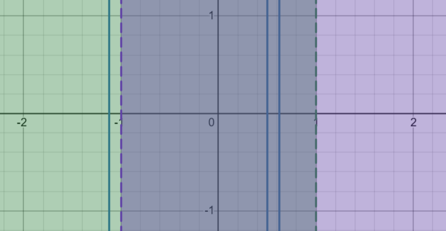
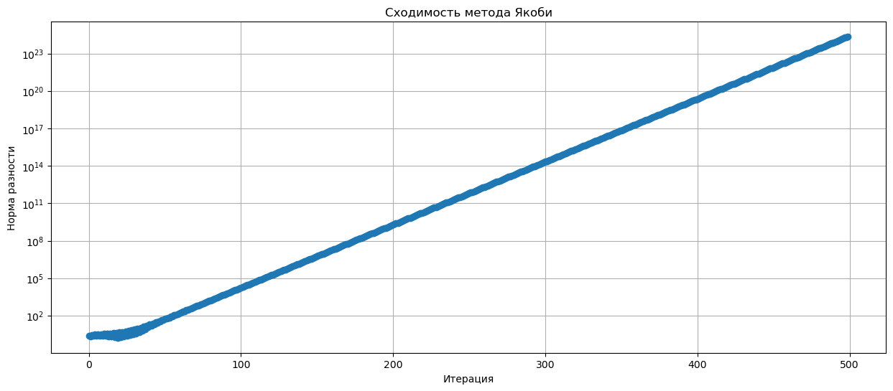
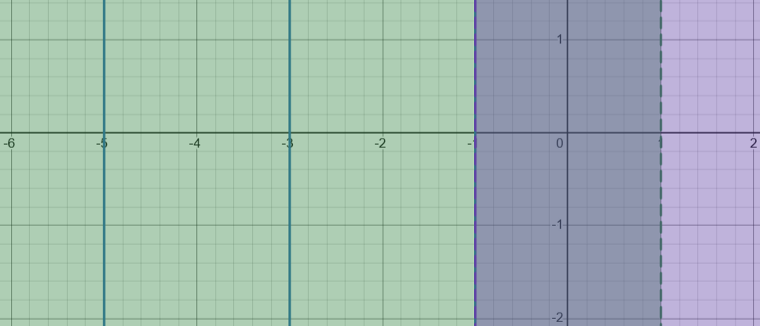
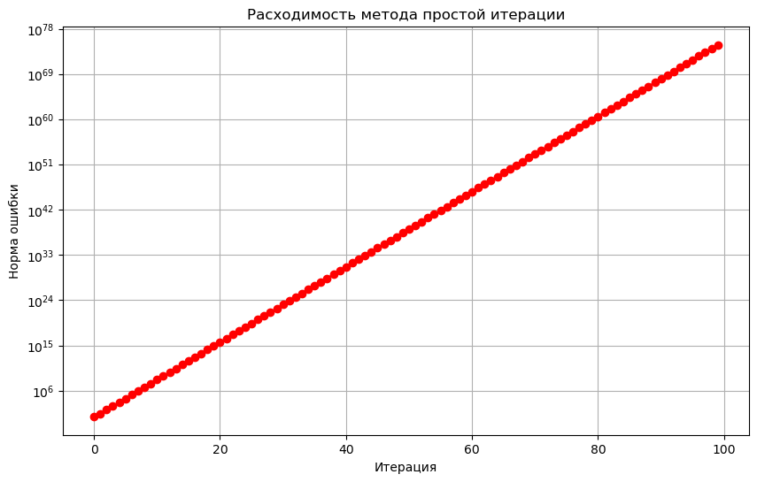
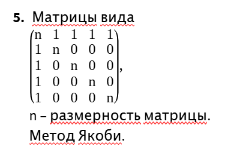

# Задание 1
Дана матрица A. Написать программу, которая решает СЛАУ  методами, соответствующими вашему варианту (в качестве вектора b взять вектор, соответствующий какому-нибудь заданному значению x). Предварительно провести теоретическое исследование сходимости каждого метода. Построить диаграммы сходимости. Какой из методов сходится быстрее? Почему?

> A = np.array([[-1, 1, -1], [-1, 4, -2], [2, -3, 5]], dtype=float)
- методы простой итерации
- Якоби

## jacobi

### Достаточное условие сходимости метода Якоби
Метод Якоби сходится, если матрица $A$ обладает **строгим диагональным преобладанием**.

- **$i=1$**
    *   $a_{11} = -1 \Rightarrow |a_{11}| = 1$.
    *   Сумма модулей недиагональных элементов: $|a_{12}| + |a_{13}| = 2$.
    *   $1 > 2$
    *   **Условие строгого диагонального преобладания НЕ выполняется.**

Поскольку условие строгого диагонального преобладания **не выполняется**, не можем гарантировать сходимость метода Якоби

### Проверка критерия
$$
B_J = \begin{pmatrix}
0 & 1 & -1 \\
0.25 & 0 & 0.5 \\
-2/5 & 3/5 & 0
\end{pmatrix}
= \begin{pmatrix}
0 & 1 & -1 \\
1/4 & 0 & 1/2 \\
-0.4 & 0.6 & 0
\end{pmatrix}
$$

Характеристический полином $\text{det}(B_J - \lambda I) = 0$:
$$
\text{det} \begin{pmatrix}
-\lambda & 1 & -1 \\
1/4 & -\lambda & 1/2 \\
-2/5 & 3/5 & -\lambda
\end{pmatrix} = -\lambda^3 + 0.95\lambda - 0.35
$$
> ! корни < 1

следовательно критерий НЕ выполняется





## simple iteration 
вычислим матрицу итераций $B = I - A$:
$$
B = I - A = \begin{pmatrix}
1 & 0 & 0 \\
0 & 1 & 0 \\
0 & 0 & 1
\end{pmatrix}
- \begin{pmatrix}
-1 & 1 & -1 \\
-1 & 4 & -2 \\
2 & -3 & 5
\end{pmatrix}
= \begin{pmatrix}
2 & -1 & 1 \\
1 & -3 & 2 \\
-2 & 3 & -4
\end{pmatrix}
$$

$$
B - \lambda I = \begin{pmatrix}
2-\lambda & -1 & 1 \\
1 & -3-\lambda & 2 \\
-2 & 3 & -4-\lambda
\end{pmatrix}
$$
$$-λ^3-9λ^2-23λ-15 = 0$$

> критерий НЕ выполняется





## различие:
Якоби «нормирует» систему через деление на диагональ
- улучшает масштаб
- уменьшает спектральный радиус
- ускоряет сходимость
 
Простая итерация не нормирует
- Система остаётся «жёсткой»

# Задание 2

- Написать программу, которая решает СЛАУ любой размерноcти для матриц указанного типа соответствующим варианту методом. При реализации метода следует учитывать структуру матрицы, то есть запрещается хранить в памяти ее избыточные нулевые элементы. В отчет включить обоснование сходимости метода для данных матриц.
- Получить решения системы для n = 10 50 100 1000 (для размерности 1000 привести лишь первые и последние 20 компонент решения), а также указать количество сделанных итераций. Критерий остановки итераций: ||Ax_k-b|| <10e^{-10}.



```
n: 10
x: [0.01098901 0.0989011  0.0989011  0.0989011  0.0989011  0.0989011
 0.0989011  0.0989011  0.0989011  0.0989011 ]
Итераций: 19

n: 50
x: [0.000408   0.01999184 0.01999184 0.01999184 0.01999184 0.01999184
 0.01999184 0.01999184 0.01999184 0.01999184 0.01999184 0.01999184
 0.01999184 0.01999184 0.01999184 0.01999184 0.01999184 0.01999184
 0.01999184 0.01999184 0.01999184 0.01999184 0.01999184 0.01999184
 0.01999184 0.01999184 0.01999184 0.01999184 0.01999184 0.01999184
 0.01999184 0.01999184 0.01999184 0.01999184 0.01999184 0.01999184
 0.01999184 0.01999184 0.01999184 0.01999184 0.01999184 0.01999184
 0.01999184 0.01999184 0.01999184 0.01999184 0.01999184 0.01999184
 0.01999184 0.01999184]
Итераций: 11

n: 500
Первые 20: [4.00799997e-06 1.99999198e-03 1.99999198e-03 1.99999198e-03
 1.99999198e-03 1.99999198e-03 1.99999198e-03 1.99999198e-03
 1.99999198e-03 1.99999198e-03 1.99999198e-03 1.99999198e-03
 1.99999198e-03 1.99999198e-03 1.99999198e-03 1.99999198e-03
 1.99999198e-03 1.99999198e-03 1.99999198e-03 1.99999198e-03]
Последние 20: [0.00199999 0.00199999 0.00199999 0.00199999 0.00199999 0.00199999
 0.00199999 0.00199999 0.00199999 0.00199999 0.00199999 0.00199999
 0.00199999 0.00199999 0.00199999 0.00199999 0.00199999 0.00199999
 0.00199999 0.00199999]
Итераций: 7

n: 1000
Первые 20: [1.00100000e-06 9.99998999e-04 9.99998999e-04 9.99998999e-04
 9.99998999e-04 9.99998999e-04 9.99998999e-04 9.99998999e-04
 9.99998999e-04 9.99998999e-04 9.99998999e-04 9.99998999e-04
 9.99998999e-04 9.99998999e-04 9.99998999e-04 9.99998999e-04
 9.99998999e-04 9.99998999e-04 9.99998999e-04 9.99998999e-04]
Последние 20: [0.001 0.001 0.001 0.001 0.001 0.001 0.001 0.001 0.001 0.001 0.001 0.001
 0.001 0.001 0.001 0.001 0.001 0.001 0.001 0.001]
Итераций: 7
```
