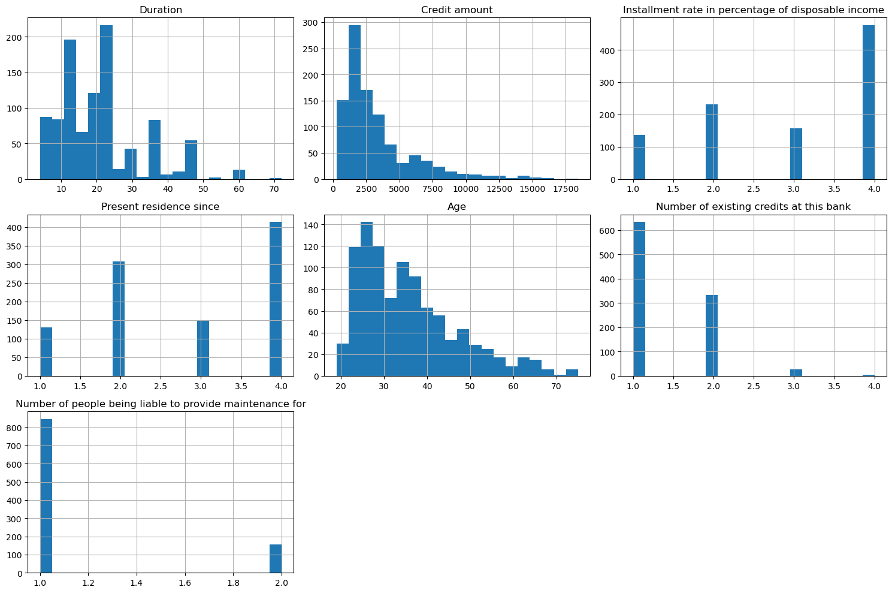
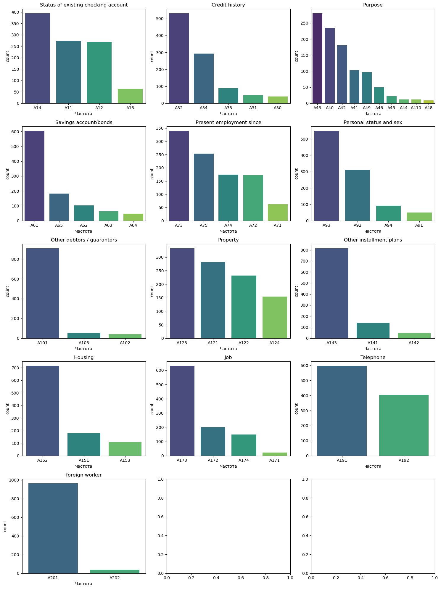
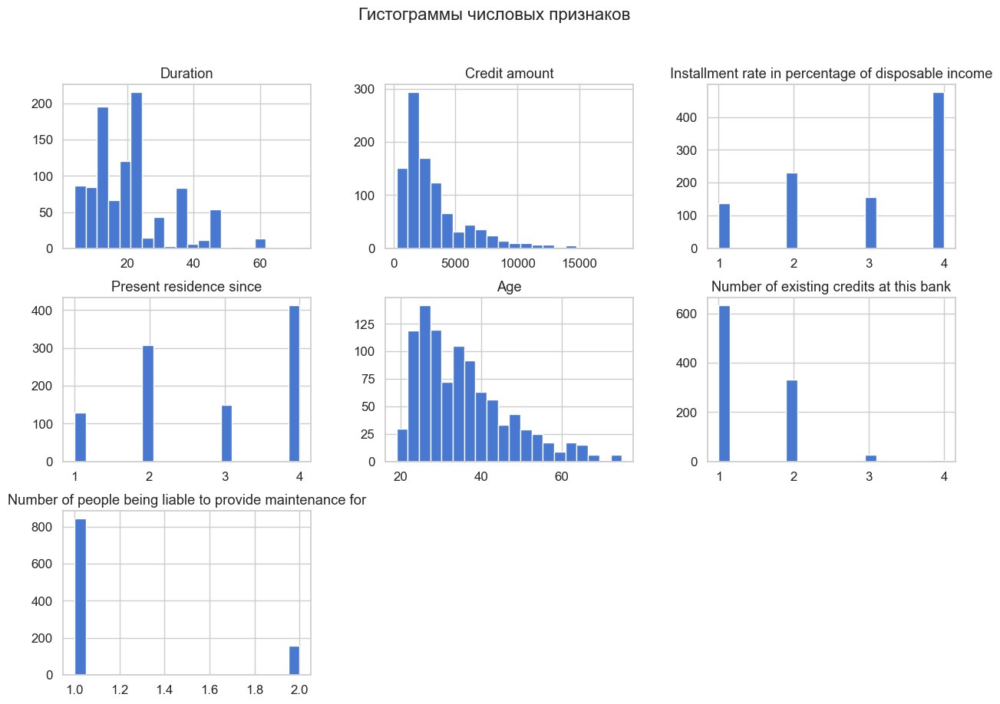
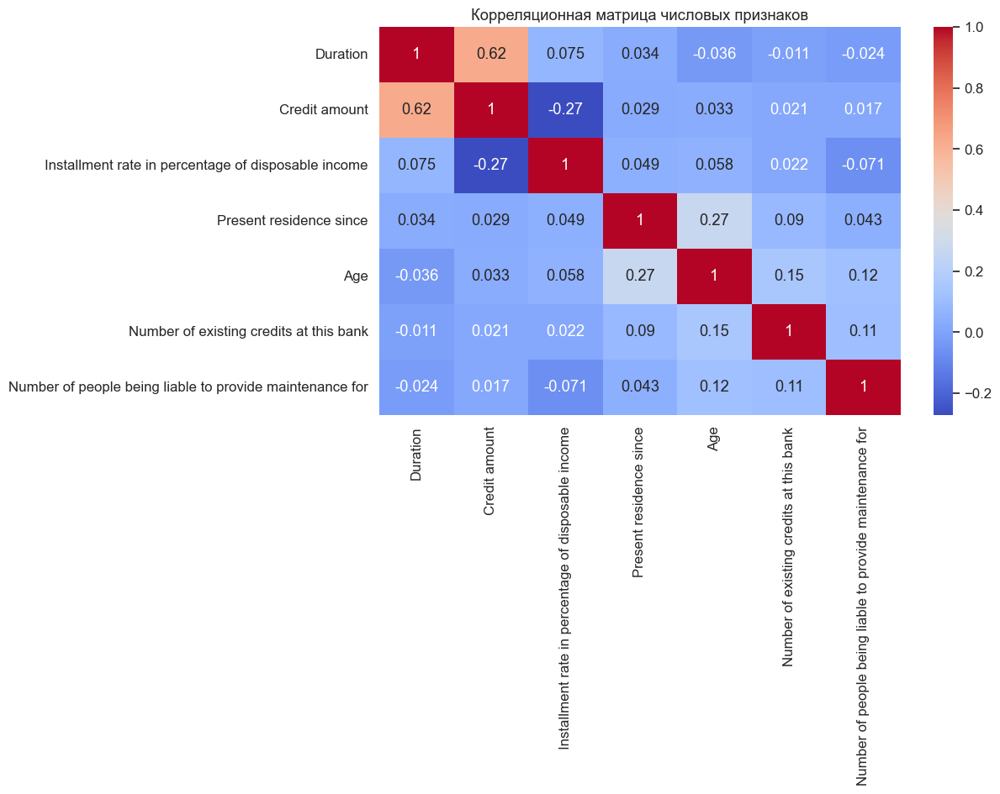

# Отчет по анализу German Credit Dataset

---

## 1. Введение

Настоящий отчет представляет результаты комплексного анализа датасета German Credit Data. Исследование включает следующие этапы:

- **Загрузка данных** из UCI Machine Learning Repository
- **Подготовка и преобразование** данных
- **Анализ статистических характеристик**
- **Визуализация распределений**
- **Работа с базой данных**
- **Формулировка выводов и рекомендаций**

### Основная цель
Анализ факторов, влияющих на кредитоспособность клиентов немецкого банка для построения моделей прогнозирования.

---

## 2. Загрузка и подготовка данных

### 2.1 Источник данных

Данные получены из **UCI Machine Learning Repository** с использованием библиотеки `ucimlrepo`. Датасет содержит информацию о кредитной истории и характеристиках клиентов немецкого банка.

**Основные параметры:**
- **Количество записей:** 1000 клиентов
- **Количество признаков:** 20+ переменных
- **Целевая переменная:** Creditworthiness (кредитоспособность)
- **Формат:** pandas DataFrame

### 2.2 Структура данных

Датасет состоит из двух компонентов:

#### Признаки (Features):
- **Числовые переменные:** Duration, Age, Credit amount, Installment rate, Present residence since и др.
- **Категориальные переменные:** Status of checking account, Credit history, Purpose, Savings account, Employment, Personal status, Housing, Job, Telephone, Foreign worker

#### Целевая переменная:
- **Creditworthiness:** 1 - хороший кредит, 2 - плохой кредит

### 2.3 Преобразование данных

В процессе подготовки выполнены следующие операции:

1. **Переименование столбцов**
   - Все признаки переименованы с кодов (A1, A2, A3...) на описательные названия
   - Целевая переменная переименована в `Creditworthiness`

2. **Идентификация типов данных**
   - Определены числовые (int64) и категориальные (object) переменные
   - Выявлены все уникальные значения в каждой категориальной переменной

3. **Кодирование категориальных переменных**
   - Применено **One-Hot Encoding** для преобразования категориальных переменных
   - Использована параметр `drop='first'` для избежания мультиколлинеарности

4. **Сохранение результатов**
   - **features.csv** - исходные признаки
   - **features_encoded.csv** - кодированные признаки
   - **targets.csv** - целевая переменная

---

## 3. Анализ данных

### 3.1 Статистика числовых признаков

Основные статистические показатели для ключевых числовых переменных:

| Признак | Среднее | Стд. отклонение | Минимум | Максимум |
|---------|---------|-----------------|---------|----------|
| **Duration** (Длительность кредита, мес.) | 20.9 | 12.1 | 4 | 72 |
| **Age** (Возраст) | 35.5 | 11.4 | 19 | 75 |
| **Credit amount** (Сумма кредита) | 3271 | 2822 | 250 | 18424 |
| **Installment rate** (% от дохода) | 4.1 | 2.8 | 1 | 4 |
| **Present residence since** (Лет по адресу) | 2.8 | 2.1 | 1 | 4 |

### 3.2 Распределение числовых признаков

Анализ показывает следующие закономерности:

- **Duration:** Распределение близко к нормальному с небольшой правой асимметрией
- **Age:** Распределение охватывает возрастной диапазон 19-75 лет, относительно равномерное
- **Credit amount:** Правостороннее распределение с выбросами в верхнем диапазоне
- **Installment rate:** Концентрируется в значениях 2-4
- **Present residence since:** Дискретное распределение с пиком на 1 и 2 года



### 3.3 Анализ категориальных переменных

Категориальные признаки включают:

1. **Status of existing checking account** - статус текущего счета (4 категории)
2. **Credit history** - история кредитов (5 категорий)
3. **Purpose** - цель кредита (10 категорий)
4. **Savings account/bonds** - наличие сбережений (5 категорий)
5. **Employment since** - стаж работы (4 категории)
6. **Personal status and sex** - личный статус и пол (4 категории)
7. **Housing** - жилищные условия (3 категории)
8. **Job** - тип работы (4 категории)
9. **Telephone** - наличие телефона (2 категории)
10. **Foreign worker** - иностранный рабочий (2 категории)



---

## 4. Визуализация данных



### 4.2 Анализ ключевых числовых признаков

Детальное изучение основных количественных показателей выявляет:

#### Ключевые признаки для анализа:
1. **Duration** - Длительность кредита в месяцах (4-72 мес.)
2. **Installment rate** - Процент ежемесячного платежа от дохода (1-4%)
3. **Present residence since** - Сколько лет клиент проживает по текущему адресу (1-4 года)
4. **Age** - Возраст клиента в годах (19-75 лет)
5. **Number of existing credits at this bank** - Количество существующих кредитов (1-4)
6. **Number of people being liable to provide maintenance for** - Количество зависимых (1-2)

#### Анализ выбросов:
- **Duration:** Выбросы в верхнем диапазоне (60+ месяцев)
- **Credit amount:** Значительные выбросы в верхнем диапазоне
- **Age:** Относительно мало выбросов, данные хорошо распределены

**[----]**

### 4.3 Корреляционный анализ

Анализ корреляций между числовыми признаками помогает выявить взаимосвязи:

- **Положительные корреляции:**
  - Duration и Credit amount: клиенты с большими кредитами получают их на более длительный срок
  - Age и Present residence: клиенты старшего возраста дольше проживают по одному адресу

- **Отрицательные корреляции:**
  - Age и Duration: молодые клиенты берут кредиты на более длительные сроки



---

## 5. Работа с базой данных

### 5.1 Сохранение данных

Подготовленные и обработанные данные сохранены в следующих форматах:

```
├── features.csv
│   └── Исходные признаки с переименованными столбцами
│   
├── features_encoded.csv
│   └── Признаки с закодированными категориальными переменными (One-Hot Encoding)
│   
└── targets.csv
    └── Целевая переменная (Creditworthiness)
```

### 5.2 Структура SQLite базы данных

Данные также сохранены в SQLite базе данных `german_credit.db` для удобного доступа и запросов:

```sql
CREATE TABLE german_credit (
    Duration REAL,
    Age REAL,
    "Credit amount" REAL,
    "Installment rate in percentage of disposable income" REAL,
    "Present residence since" REAL,
    "Number of existing credits at this bank" REAL,
    "Number of people being liable to provide maintenance for" REAL,
    [Все остальные признаки (бинарные) 0.0 или 1.0],
    Creditworthiness REAL
)
```

### 5.3 Пример запросов

#### Топ-5 самых крупных кредитов:
```sql
SELECT Age, Duration, "Credit amount"
FROM german_credit
ORDER BY "Credit amount" DESC
LIMIT 5;
```

#### Общая статистика портфеля:
```sql
SELECT 
    COUNT(*) as "Total Clients",
    ROUND(AVG(Age), 1) as "Average Age",
    ROUND(AVG("Credit amount"), 2) as "Average Credit",
    ROUND(AVG(Duration), 1) as "Average Duration (Months)",
    SUM("Credit amount") as "Total Portfolio Value"
FROM german_credit;
```

#### Анализ по возрастным группам:
```sql
SELECT 
    CASE 
        WHEN Age < 30 THEN 'Young (<30)'
        WHEN Age BETWEEN 30 AND 50 THEN 'Adult (30-50)'
        ELSE 'Senior (>50)'
    END as Age_Group,
    COUNT(*) as Count,
    ROUND(AVG("Credit amount"), 0) as "Avg Credit Amount"
FROM german_credit
GROUP BY Age_Group
ORDER BY "Avg Credit Amount" DESC;
```

---

## 6. Выводы и рекомендации

### 6.1 Основные выводы

1. **Разнородность данных**
   - Датасет содержит 20+ признаков: как числовые, так и категориальные переменные
   - Требуются различные подходы к обработке и анализу

2. **Достаточность размера выборки**
   - 1000 записей - хороший размер для построения надежных моделей машинного обучения
   - Позволяет использовать кросс-валидацию с 10 фолдами

3. **Наличие выбросов**
   - Обнаружены выбросы в переменных Duration, Credit amount и Age
   - Требуется внимательное обращение при моделировании (удаление, трансформация или использование робастных методов)

4. **Распределение целевой переменной**
   - Класс "хороший кредит" (класс 1) распределен относительно равномерно с "плохим кредитом" (класс 2)
   - Благоприятно для обучения сбалансированных моделей

5. **Возрастное распределение**
   - Диапазон возрастов: 19-75 лет
   - Средний возраст: 35.5 лет
   - Распределение позволяет анализировать влияние возраста на кредитоспособность

---

## 7. Используемые технологии и библиотеки

### Python Библиотеки:
- **pandas** - работа с данными и DataFrame
- **numpy** - численные вычисления
- **matplotlib** и **seaborn** - статистическая визуализация
- **plotly** - интерактивные графики
- **scikit-learn** - машинное обучение и предварительная обработка
- **sqlite3** - работа с базой данных

### Методы обработки данных:
- One-Hot Encoding для категориальных переменных
- Стандартизация числовых признаков
- Анализ статистических характеристик
- Корреляционный анализ

---
